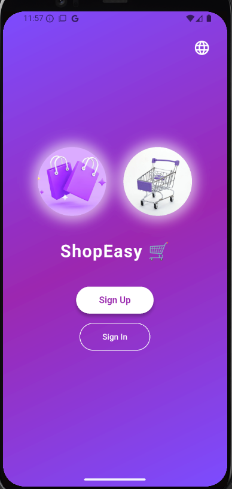
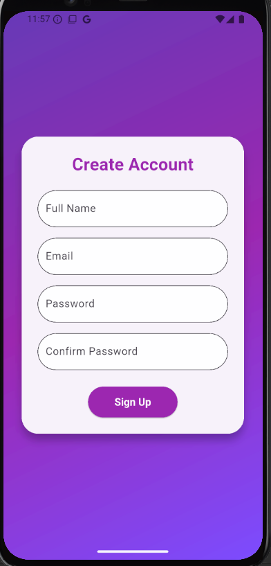
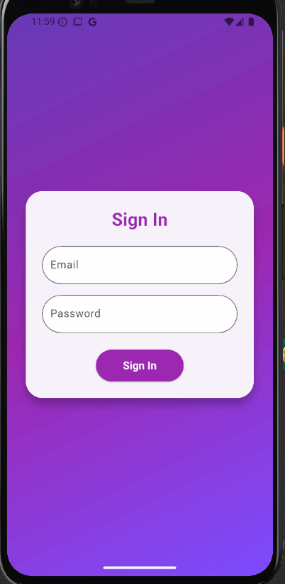
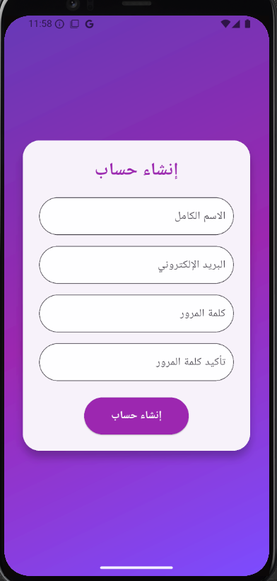
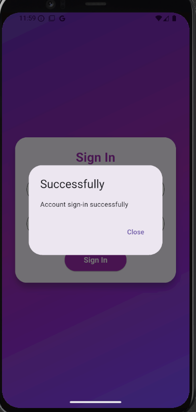
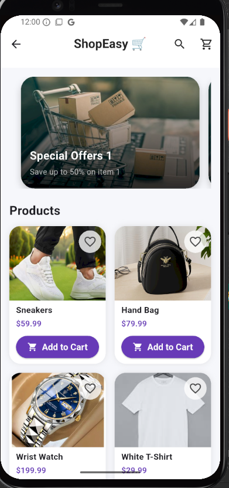
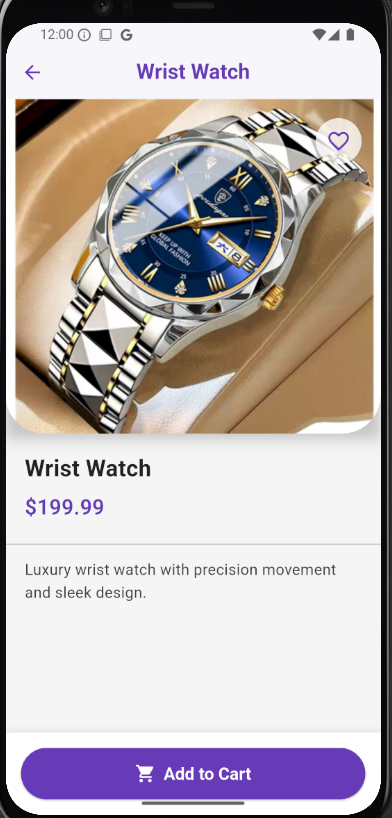

# 🌟 ShopEasy - E-commerce Flutter Application 🌟
## 📋 Overview
ShopEasy is a modern e-commerce mobile application built with Flutter. This app allows users to browse products, view special offers, and manage their accounts with sign-in and sign-up functionalities. The app supports multiple languages (English and Arabic) and features a user-friendly interface with smooth animations.

## ✨ Features
- 🛒 Product Browsing: View a grid of products with details like price and description. 
- 🎁 Special Offers: Display a carousel of special offers with discounts. 
- 🔐 User Authentication: Sign up and sign in with email and password.
- 🌐 Language Support: Switch between English and Arabic. 
- 📝 Product Details: View detailed product information and add to cart. 
- 📱 Responsive Design: Optimized for mobile screens.
## 📂 Project Structure
Below is the organized structure of the project files:

```plaintext
lib/
├── 📁 generated/
│   └── 📁 intl/
│       ├── 📄 messages_all.dart
│       ├── 📄 messages_ar.dart
│       ├── 📄 messages_en.dart
│       └── 📄 l10n.dart
├── 📁 l10n/
│   ├── 📄 intl_ar.arb
│   └── 📄 intl_en.arb
├── 📁 models/
│   ├── 📄 offer.dart
│   └── 📄 product.dart
├── 📁 screens/
│   ├── 📁 home/
│   │   ├── 📁 widgets/
│   │   │   ├── 📄 home_appbar.dart
│   │   │   ├── 📄 offers_carousel.dart
│   │   │   └── 📄 product_grid.dart
│   │   └── 📄 home_screen.dart
│   ├── 📁 product details/
│   │   └── 📄 product_details_screen.dart
│   ├── 📁 signin/
│   │   ├── 📁 widgets/
│   │   │   ├── 📄 signin_field.dart
│   │   │   └── 📄 signin_form.dart
│   │   └── 📄 signin_screen.dart
│   ├── 📁 signup/
│   │   ├── 📁 widgets/
│   │   │   ├── 📄 sign_up_button.dart
│   │   │   ├── 📄 sign_up_field.dart
│   │   │   └── 📄 sign_up_form.dart
│   │   └── 📄 signup_screen.dart
│   └── 📁 welcome/
│       ├── 📁 widgets/
│       │   ├── 📄 action_buttons.dart
│       │   ├── 📄 animated_logo.dart
│       │   ├── 📄 animated_text.dart
│       │   └── 📄 animation.dart
│       └── 📄 welcome_screen.dart
├── 📄 main.dart
└── 📄 routes.dart
``` 

# 📸 Screenshots
<table>
  <tr>
    <td></td>
    <td></td>
    <td></td>
    <td></td>
  </tr>
  <tr>
    <td></td>
    <td></td>
    <td></td>
  </tr>
</table>

- 🎉 Welcome Screen: Displays the app logo and sign-up/sign-in buttons.
- 📝 Sign Up Screen: Form to create a new account.
- 🔑 Sign In Screen: Form to log into an existing account.
- 🏠 Home Screen: Shows special offers and product grid.
- ℹ️ Product Details Screen: Detailed view of a selected product.

## 🚀 Installation

Clone the repository:
```bash
git clone https://github.com/your-username/shop-easy.git
```
Navigate to the project directory:
```bash
cd shop-easy
```
Install dependencies:
```bash
flutter pub get
```
Run the app:
```bash
flutter run
```
## 📖 Usage
- 🚀 Launch the app to see the welcome screen.
- 📝 Sign up or sign in to access the home screen.
- 🛍️ Browse products, view offers, and navigate to product details.
- 🌐 Switch languages using the language icon on the welcome screen.

